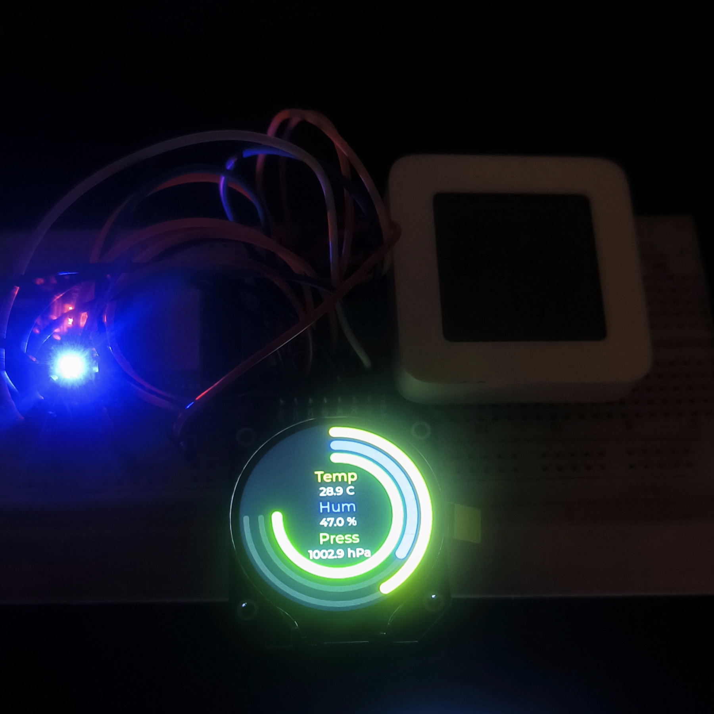
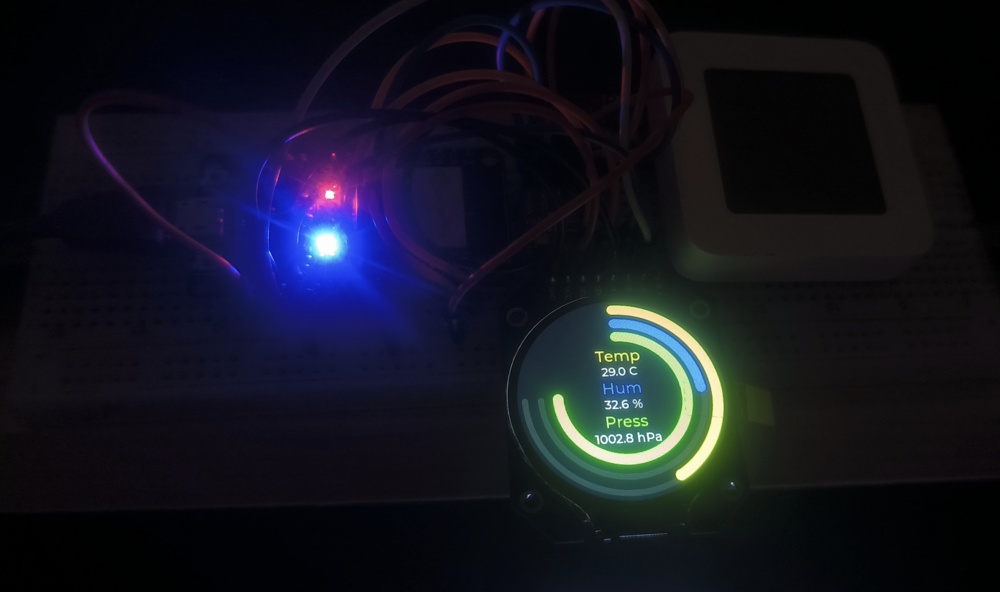

# Метеостанция(meteo-ESP32-TFT_eSPI) - LVLG-version !!!

**Проект домашней метеостанции на LVGL и TFT-eSPI**

### Фото работы дисплея
___

### Железо
___
- ESP-WROM-32 (ESP32 Devkit v1);
- BME280;
- CCS811;
- TFT 1.28inch Round GC9A01

### Зависимости
___
- [GyverBME280](https://github.com/GyverLibs/GyverBME280.git)
- [CCS811](https://github.com/sparkfun/SparkFun_CCS811_Arduino_Library.git)
- [FastBot2](https://github.com/GyverLibs/FastBot2.git) 
- [TFT_eSPI](https://github.com/Bodmer/TFT_eSPI.git)
- [LVGL](https://github.com/lvgl/lvgl.git) //v9.1.0

## Содержание
___
- Заглушка
- Заглушка2

## Версии
___
- v1.0
