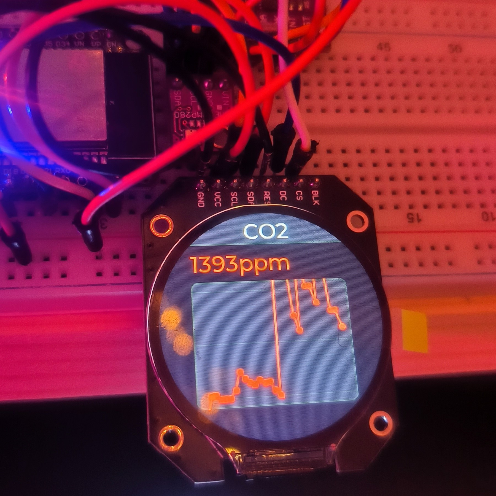

# Метеостанция(meteo-ESP32-TFT_eSPI) - LVLG-version !!!

**Этот проект демонстрирует, как считывать данные о температуре, влажности и CO2 с датчиков BME280 и CCS811; отображение данных с помощью LVGL. Данные с датчиков обновляются в режиме реального времени с помощью графического интерфейса пользователя (GUI), работающего во встроенной системе.**

## Фото работы дисплея
___

## Железо
___
- ESP-WROM-32 (ESP32 Devkit v1);
- BME280;
- CCS811;
- TFT 1.28inch Round GC9A01

## Зависимости
___
- [GyverBME280](https://github.com/GyverLibs/GyverBME280.git) //v1.5.3
- [Sparkfun_CCS811](https://github.com/sparkfun/SparkFun_CCS811_Arduino_Library.git) //v2.0.3
- [FastBot2](https://github.com/GyverLibs/FastBot2.git) 
- [TFT_eSPI](https://github.com/Bodmer/TFT_eSPI.git) //v2.5.43
- [LVGL](https://github.com/lvgl/lvgl.git) //v9.1.0

## Распиновка
___
| GC9A01 Pin | ESP32 Pin | Description |
| --- | --- | --- |
| VCC | 3.3V | Power supply |
| GND | GND | Ground |
| CS | GPIO 15 | Chip Select |
| RST | GPIO 4 | Reset |
| DC (RS) | GPIO 2 | Data/Command |
| SDI (MOSI) | GPIO 23 | SPI Master Out Slave In |
| SCK(CLK) | GPIO 18 | SPI Clock |

## Версии
___
- v1.0
